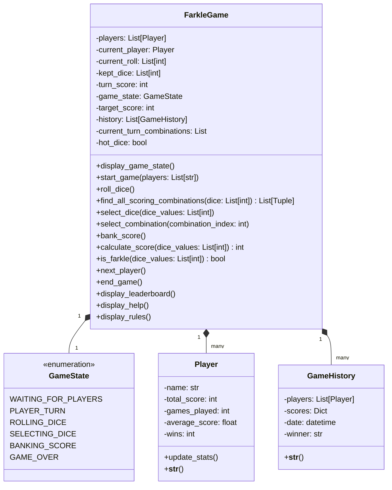

```mermaid	
classDiagram
    class FarkleGame {
        -players: List[Player]
        -current_player: Player
        -current_roll: List[int]
        -kept_dice: List[int]
        -turn_score: int
        -game_state: GameState
        -target_score: int
        -history: List[GameHistory]
        -current_turn_combinations: List
        -hot_dice: bool
        +display_game_state()
        +start_game(players: List[str])
        +roll_dice()
        +find_all_scoring_combinations(dice: List[int]) List[Tuple]
        +select_dice(dice_values: List[int])
        +select_combination(combination_index: int)
        +bank_score()
        +calculate_score(dice_values: List[int]) int
        +is_farkle(dice_values: List[int]) bool
        +next_player()
        +end_game()
        +display_leaderboard()
        +display_help()
        +display_rules()
    }

    class Player {
        -name: str
        -total_score: int
        -games_played: int
        -average_score: float
        -wins: int
        +update_stats()
        +__str__()
    }

    class GameState {
        <<enumeration>>
        WAITING_FOR_PLAYERS
        PLAYER_TURN
        ROLLING_DICE
        SELECTING_DICE
        BANKING_SCORE
        GAME_OVER
    }

    class GameHistory {
        -players: List[Player]
        -scores: Dict
        -date: datetime
        -winner: str
        +__str__()
    }

    FarkleGame "1" *-- "1" GameState
    FarkleGame "1" *-- "many" Player
    FarkleGame "1" *-- "many" GameHistory
```