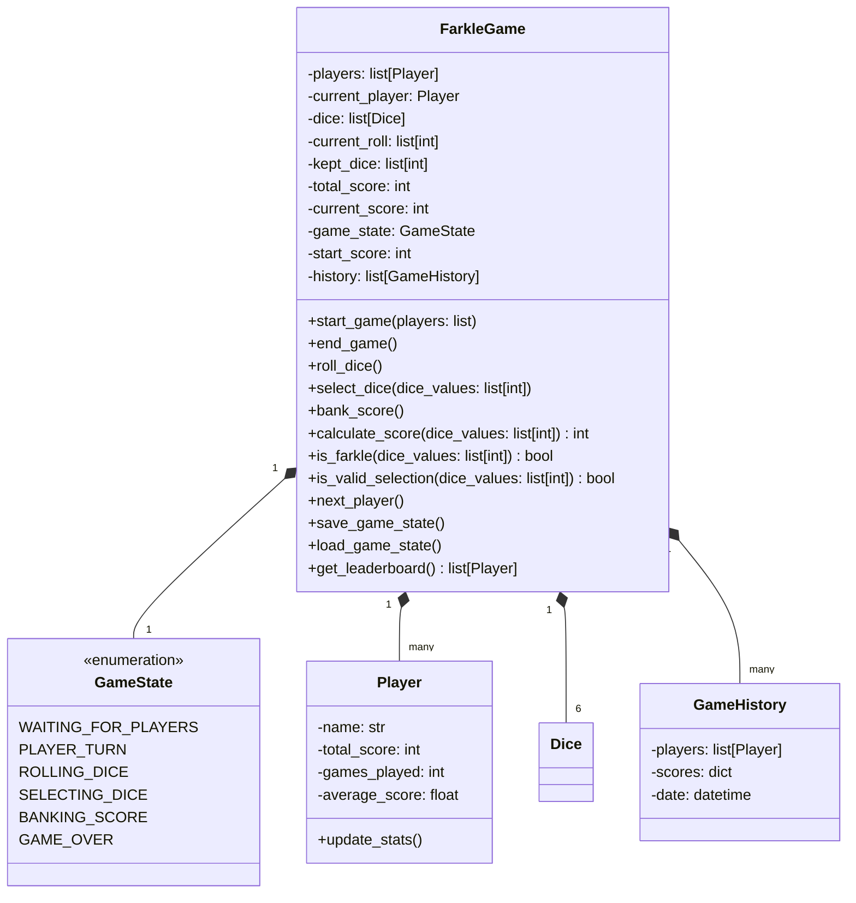

```mermaid	
classDiagram
    class FarkleGame {
        -players: list[Player]
        -current_player: Player
        -dice: list[Dice]
        -current_roll: list[int]
        -kept_dice: list[int]
        -total_score: int
        -current_score: int
        -game_state: GameState
        -start_score: int
        -history: list[GameHistory]
        +start_game(players: list)
        +end_game()
        +roll_dice()
        +select_dice(dice_values: list[int])
        +bank_score()
        +calculate_score(dice_values: list[int]) int
        +is_farkle(dice_values: list[int]) bool
        +is_valid_selection(dice_values: list[int]) bool
        +next_player()
        +save_game_state()
        +load_game_state()
        +get_leaderboard() list[Player]
    }

    class Player {
        -name: str
        -total_score: int
        -games_played: int
        -average_score: float
        +update_stats()
    }

    class GameState {
        <<enumeration>>
        WAITING_FOR_PLAYERS
        PLAYER_TURN
        ROLLING_DICE
        SELECTING_DICE
        BANKING_SCORE
        GAME_OVER
    }

    class GameHistory {
        -players: list[Player]
        -scores: dict
        -date: datetime
    }

    FarkleGame "1" *-- "1" GameState
    FarkleGame "1" *-- "many" Player
    FarkleGame "1" *-- "6" Dice
    FarkleGame "1" *-- "many" GameHistory
```